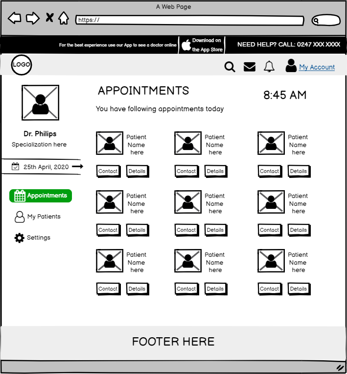

# MyProject

I worked on a freelance project couple of years ago as a Technical Business Analyst. The project was Web portal for Medical Services. My key role was to analyse the requirements by communicating with the stakeholders and create wireframes. 

## Overview
This project contains wireframes for a Medical Online Portal designed to streamline patient and healthcare provider interactions. The portal aims to provide patients with an easy way to manage appointments, access medical records, and communicate with healthcare providers.

## Features
The Medical Online Portal consisted of the following core features for which I had created a few wireframes:

1. **Login and Registration**:
   - Screens for patient login, registration, and password recovery.
2. **Dashboard**:
   - An overview for patients, including upcoming appointments and recent messages.
3. **Appointment Booking**:
   - Users can view available slots and book an appointment with healthcare providers.
4. **Medical Records**:
   - Secure access to personal medical history and lab reports.
5. **Messaging**:
   - A simple interface for patients to communicate with healthcare professionals.

## Wireframes

Below is the wireframe I created for "Appointments" page.

Please note that this project is a conceptual representation and contains limited information due to confidentiality. Below is a summary of the key screens that were included:

- **Login Screen**
- **Dashboard**
- **Appointment Booking**
- **Medical Records**
- **Messaging**

## Requirements
For more details on the functional requirements of the Medical Online Portal, see the [requirements page](Requirements/FunctionalRequirements.md) folder.

